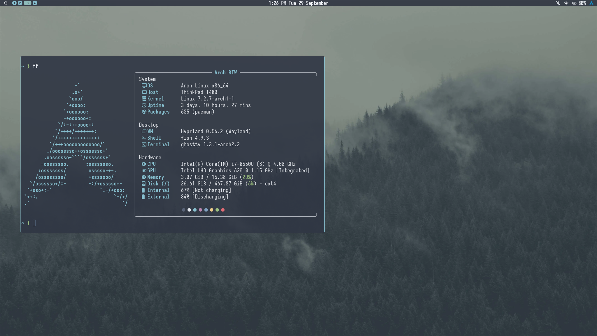

# .dotfiles



Arch Linux + Hyprland on a ThinkPad T480. The whole setup follows a soothing
**Onenord** colorscheme: easy on the eyes for long sessions, and built around a
fast, keyboard-driven coding workflow in the terminal.

| | |
|---|---|
| **WM** | [Hyprland](https://hypr.land) (Lua config) |
| **Shell / bar** | [Noctalia](https://github.com/noctalia-dev/noctalia) v5, built-in Nord theme (not the legacy v4 `noctalia-shell`) |
| **Terminal** | [Ghostty](https://ghostty.org) + tmux |
| **Shell** | fish + [Starship](https://starship.rs) |
| **Editor** | Neovim ([LazyVim](https://www.lazyvim.org)) |
| **Fetch** | fastfetch |
| **Theme** | Onenord / Nord |
| **Font** | Iosevka Nerd Font |

## Requirements

- **Iosevka Nerd Font** (or any Nerd Font). Without one, the icons in fastfetch, Starship and Neovim render as boxes.
- **Hyprland with Lua config support** (tested on 0.56). This won't load on older, `.conf`-only versions.
- **Noctalia v5**, started by Hyprland on login
- `grim`, `slurp`, `wl-clipboard` for region screenshots (`SUPER + P`)
- `wireplumber` (`wpctl`), `brightnessctl`, `playerctl` for the media and brightness keys
- `thunar` and `zen-browser` are bound to keys. Swap them at the top of `hypr/hyprland.lua`.
- **Optional:** TLP. The fastfetch battery lines read `BAT0` (internal) and `BAT1` (external), the same names TLP uses on ThinkPads with two batteries.

## Keybinds worth knowing

| Keys | Action |
|---|---|
| `SUPER + Return` | Terminal |
| `SUPER + SHIFT + Return` | Floating terminal in the bottom-left corner (for screenshots) |
| `SUPER + Space` | Noctalia launcher |
| `SUPER + H/J/K/L` | Move focus (`+ SHIFT` to move the window) |
| `SUPER + V` | Toggle floating |
| `SUPER + P` | Screenshot a region to the clipboard |

## How this repo works

This repo **is** `~/.config`. Instead of symlinks or GNU Stow, `.gitignore`
ignores everything (`/*`) and re-includes only the tools I track (`!/nvim`,
`!/hypr`, ...). Apps constantly write caches, logs and login tokens into
`~/.config`, and with an allowlist none of that can be committed by accident.

**Noctalia:** v5 saves changes made in its settings GUI to
`~/.local/state/noctalia/settings.toml`, which is outside this repo, and that file
overrides `noctalia/config.toml`. After changing settings in the GUI, sync them
back with:

```sh
noctalia config export > ~/.config/noctalia/config.toml
```

Before committing, remove the machine-specific `[location]` and `[wallpaper]`
sections from the exported file.

**To use it:** the easiest way is to copy the folder you want. To take the whole
thing, back up your `~/.config` first, because checking out the repo will
overwrite any files that have the same names:

```sh
cd ~/.config
git init
git remote add origin https://github.com/zarekcodes/.dotfiles.git
git fetch origin
git checkout -f main
```
